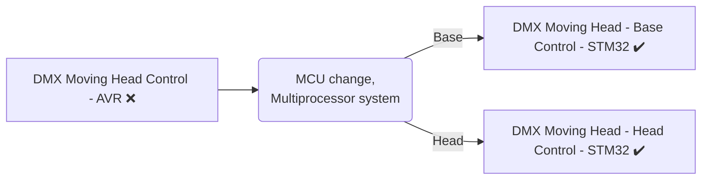
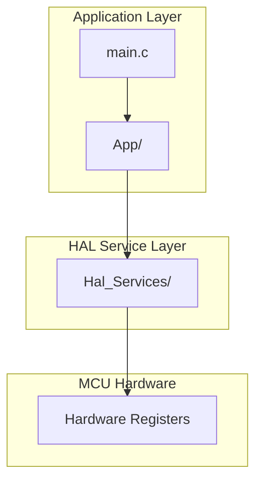

# DMX Moving Head controlling firmware for ATmega328P microcontroller

> ### ⚠️ Project Status: migrated to STM32
> **Note:** This AVR based version is no longer maintained. 
> Development has migrated to the new, STM32  architecture here: 
> **[dmx-moving-head-control-b-stm32](https://github.com/bagobalint10/dmx-moving-head-control-b-stm32)** and here: **[dmx-moving-head-control-h-stm32](https://github.com/bagobalint10/dmx-moving-head-control-h-stm32)**

---

> ### ❗❗ Bachelor's Thesis
> **Note:** I wrote my **[Thesis](https://drive.google.com/file/d/1uE1WsgICa_NFbQyPtikY8qTVwxYJvNp_/view?usp=sharing)** from this project. All references in the thesis correspond to version **[Final 0.0](https://github.com/bagobalint10/dmx-moving-head-control-avr/commit/e74d1eb)** of this repository. 


## General Information

This project aimed to create a fully functional control system for a `Futurelight MH-660` moving head based on an `Atmega328P` AVR microcontroller, because I owned one of these units, but it didn't work well.

During the project, it became clear that this AVR MCU didn't have enough peripherals (specifically 16-bit timers ) and an FPU. Both of these were necessarry for the final project, that needs to control multiple motors at the same time and calculating acceleration. 
Therefore I decided to migrate the project to another Microcontroller. I chose an `STM32F401CCU6` because it has two 32-bit timers and an FPU. After realizing this Microcontroller didn't have enough pins and PWM channels for the entire project, I divided the project into two parts. 
One MCU is solely responsible for controlling the head motors, while the other manages the base motors and the control panel (acting as the master device). These projects have been completely finished and can be viewed these repositories.


Head Repository: **[dmx-moving-head-control-h-stm32](https://github.com/bagobalint10/dmx-moving-head-control-h-stm32)**

Base Repository: **[dmx-moving-head-control-b-stm32](https://github.com/bagobalint10/dmx-moving-head-control-b-stm32)**




### Video of the final device in operation

[](https://www.youtube.com/watch?v=WdRwiUQ4uc4)

## Technical Specifications

MCU: ATmega328P

Language: C 

IDE: Microchip Studio 7.0

Hardware: Futurelight MH-660 Moving Head

## Features

- ✔️ User interface management
  - 8 segment display
  - Buttons
  - Save settings to EEPROM
  - Configurable DMX Adress
- ✔️ Reading DMX signal
- ✔️ Turning on/off the lightsource
- ✔️ Pan stepper motor control
- ❌ Tilt stepper motor control

✔️ = Done, ❌ = Interrupted

## Software Architecture

The firmware follows a layerd architecture for easier portability and maintainability.



### Application Layer - [App/](dmx_moving_head_control_avr/Firmware/App/)

- The software modules in this layer are using the HAL / Service Layer to communicate with the hardware and contain the high-level logic.

### Hal / Service Layer - [Hal_Services/](dmx_moving_head_control_avr/Firmware/Hal_Services/)

- This layer's software modules perform register-level operations and contain low-level drivers.

### Other - [Other/](dmx_moving_head_control_avr/Firmware/Other/)

- It contains test codes and the port configuration header.

## Folder Structure

```

dmx_moving_head_control_avr/ 
    ├── main.c                  # entry point            
    └── Firmware/               # all software modules
        ├── App/                # app layer 
        │   ├── Inc/            # header files
        │   └── Src/            # source files
        ├── Hal_Services/       # hal/service layer
        │   ├── Inc/            # header files
        │   └── Src/            # source files
        └── Other/              # other codes

``` 

## Author 
[Bagó Bálint](https://github.com/bagobalint10) – [LinkedIn](https://www.linkedin.com/in/b%C3%A1lint-bag%C3%B3-49000123a/)  

2025/10/09

